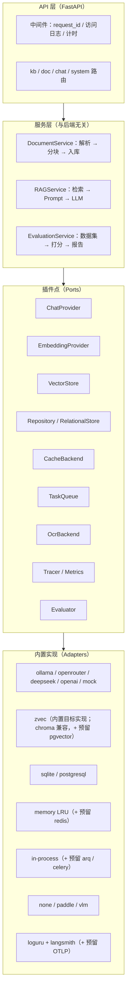

# inner-rag 开发计划 v1.0

> 本文档是项目**唯一入口**：既说明我们造什么、为什么这么造，也定义「做完什么才算完成」。
> 每个阶段收尾时，先按第 5 节的**门禁（G0–G3）**验证，再按第 8 节的规范提交与推送。

## 0. 文档地图

| 文档 | 回答什么问题 |
| --- | --- |
| `docs/DEVELOPMENT_PLAN.md`（本文） | 宗旨、现状、路线、阶段 DoD、门禁、里程碑、风险 |
| `docs/architecture.md` | 可插拔的边界在哪、插件点契约是什么、新增/替换一个后端要动什么 |
| `docs/observability.md` | LangSmith 追踪怎么接、日志/指标长什么样、怎么排障 |
| `docs/evaluation.md` | 回答准确性怎么量化、龙族评测集怎么建、门禁阈值怎么定 |
| `docs/testing.md` | 测试分几层、fixture 怎么写、CI 跑什么 |
| `docs/datasets/dragon_king/` | 真实评测语料（评测集 + 离线短片段 fixture） |
| `benchmark/`（含其 `README.md`） | 指标怎么算、怎么跑、结果怎么写进 README 基准表 |

历史阶段（Phase 0–2.1）的执行记录已并入第 2 节与第 9 节（ADR），旧的 `docs/roadmap.md` 已废弃删除。

## 1. 宗旨与不变量

**宗旨**：做一个**企业内部知识库问答系统**——把企业里散落的文档变成可检索、可引用、可审计的知识，
并且在模型后端、存储、可观测设施上都能随环境替换，而不是绑死在某一家的技术栈上。

四条宗旨（缺一不可，按优先级排序）：

1. **可插拔（Pluggable）**：Chat 模型、Embedding 模型、向量库、关系库、缓存、任务队列、OCR、
   追踪后端都必须能替换。替换方式是「改配置」或「注册一个实现」，**不允许**改业务代码。
2. **可观测（Observable）**：解析、分块、嵌入、检索、Prompt 组装、模型调用、缓存命中这些关键步骤
   都要能被计时与追踪；线上出问题时能定位到具体步骤，而不是只有一个 500。
3. **可评估（Evaluable）**：回答准确性必须可量化、可回归。每个改动都要能回答
   「检索召回变好了吗？引用还对不对？回答更准确了吗？」，而不是凭感觉。
4. **可部署（Deployable）**：`uv sync` + 一次迁移就能跑；开发默认 SQLite 单文件，部署切 PostgreSQL；
   代码、迁移脚本、镜像与配置模板对两种库都成立。

不变量（任何阶段都不许破坏）：

- **配置驱动**：模型后端、数据库、存储路径只从 `.env` / 环境变量读，不接受 HTTP 请求传入后端地址。
- **密钥外置**：密钥只出现在 `.env`（已 gitignore）与运行环境变量里；日志、异常、追踪、提交里都不许出现。
- **行为契约**：配置错误返回**可读的 503** 并指名该改哪个环境变量；`/api/system/health` 永不 5xx。
- **离线可用**：默认测试与 CI 不联网、不花钱、不受开发者本机 `.env` 影响；真实调用必须显式开启。
- **引用可核对**：回答必须带来源（文件 + 位置 + 相关度），且来源要能回溯到原文。

## 2. 现状基线（Phase 0–2.1 已交付）

已经具备（这是后续阶段的起点，不要重复造）：

| 领域 | 现状 | 缺口 |
| --- | --- | --- |
| 模型后端 | `providers/` 抽象层：Chat `ollama / openrouter / deepseek / openai / mock`，Embedding `ollama / openrouter / openai / mock`；实例缓存、探活与模型发现、`ProviderError` → 503 | 插件注册是硬编码分支（`specs._build` + `chat.build_chat_model`），第三方扩展要改源码 |
| 向量库 | **zvec 为项目选型**（Alibaba 开源嵌入式向量库，见第 9 节 ADR）；当前代码用 ChromaDB 持久化，按知识库分 collection，cosine 空间，三策略检索（similarity / mmr / hybrid），真实相关度 | 没有 `VectorStore` 接口，服务层直接依赖 `langchain-chroma`，换库要改 `services/vector_store.py`；zvec 适配器待 Phase 5 落地 |
| 关系库 | SQLAlchemy 2.1 + Alembic；SQLite（开发默认，WAL + 外键 + 等锁超时）与 PostgreSQL 共用一套迁移 | 服务层直接写 ORM/会话，没有 repository 边界；无 MySQL 等第三方方言验证 |
| 缓存 | 进程内 LRU（query cache 按 kb 精确失效 + embedding cache 按 `provider:model` 隔离） | 多 worker 下失效；没有 Redis 等外部后端 |
| 后台任务 | FastAPI `BackgroundTasks` 解析入库 | 无队列、无重试、无进度、无并发上限 |
| 可观测 | loguru 文本日志（`logs/app.log`）、检索日志与 Prompt 统计（`/api/system/stats`） | 无 request_id、无结构化字段、无 tracing、无指标端点；跨步骤耗时无法归因 |
| 测试 | 89 个离线用例（含 `benchmark/` 的 15 个指标/数据集单测）+ 5 个 `-m live` 联网用例；离线用例强制 mock provider | 无 LLM-as-judge、无真实小库基线；`docs/samples/acceptance.txt` 只验证链路通不通 |
| 评测 | 评测集、离线 fixture、基准脚本已入库（`docs/datasets/dragon_king/`、`benchmark/`） | 真实小库/全库评测依赖本地 PDF 与 provider Key，尚未跑出正式基线 |
| 交付 | Dockerfile + compose（PostgreSQL 16 / 后端镜像）、Alembic、README | 镜像与 PG 路径未实测；无 CI |

关键事实（写方案时要用到的数）：

- 真实的评测语料 `data/uploads/龙族.pdf`：**11,165 页 / 2,362,491 字符**（每页约 212 字符，移动端排版），
  含「Sakura / 路明非」相关页 65 页，全库按 `CHUNK_SIZE=1000 / overlap=200` 估算约 **2,900–3,000 个分块**。
- 评测集与基准脚本已入库：`docs/datasets/dragon_king/eval_v1.jsonl`（9 题）+ 10 段离线短片段 + `benchmark/`；
  `--mode fixtures` 完全离线可跑（mock provider + 短片段），`--mode kb` 才用本地 PDF 建的真实知识库。
- 当前默认 embedding 是 `openrouter:liquid/lfm-2.5-embedding-350m:free`（免费、1024 维、
  **512 token 上下文**，配 `EMBEDDING_MAX_INPUT_CHARS=400`），检索效果受截断影响，评测时必须记录该配置。

## 3. 目标架构



插件点契约与「怎么加一个新后端」写在 `docs/architecture.md`；每个插件点都必须有：
**接口 + 内置实现 + 配置项 + 探活 + 契约测试**，五件套齐全才算「可插拔」。

## 4. 阶段路线（Phase 3–8）

每阶段固定包含：目标 → 主要改动 → 阶段测试 → DoD（完成定义）。门禁见第 5 节。

### Phase 3 — 可观测性：LangSmith 追踪 + 运行日志 + 指标

**目标**：一次问答的每一步（检索/嵌入/组装/生成）都能被计时、归因、回放；线上排障从「看日志猜」
变成「看 trace 定位」。

**主要改动**
- 新增 `src/inner_rag/core/observability.py`（Tracer 插件点）：
  - 环境变量驱动接入 LangSmith（`LANGSMITH_TRACING` / `LANGSMITH_API_KEY` / `LANGSMITH_PROJECT` /
    `LANGSMITH_ENDPOINT` / `LANGSMITH_WORKSPACE_ID`），**默认关闭**；
  - 未配置 Key 或网络不可达时自动降级为「本地日志 + 计时」，一行 warning 说明原因，**不影响请求**；
  - 提供 `@traceable_step(name)` 与 `trace_context(metadata)`，统一注入 metadata / tags。
- 关键步骤埋点：文档解析、分块、批量嵌入、向量检索、缓存查询、Prompt 组装、LLM 调用（含 token 用量）、
  SSE 首 token 延迟与整体延迟。
- trace metadata 约定（贯穿全链）：`session_id=conv_id`（LangSmith 的 thread）、`kb_id`、`doc_id`、
  `provider`、`model`、`top_k`、`rerank_top_k`、`strategy`、`cache_hit`、`app_version`、`env`。
- FastAPI 运行日志：`RequestIdMiddleware`（生成/透传 `X-Request-ID`）、访问日志（方法、路径、状态码、
  耗时、request_id）、结构化 JSON 输出开关（`LOG_FORMAT=text|json`）、异常日志带 request_id 与上下文。
- 指标：`GET /api/system/metrics`（延迟分位、检索命中率、空召回率、缓存命中率、token 用量与估算成本）；
  预留 Prometheus / OTLP 导出（`METRICS_BACKEND=none|prometheus`）。
- 配置项全部进 `.env.example`，并在 README 增补「可观测性」小节。细节见 `docs/observability.md`。

**阶段测试**
- 离线：无 Key 时 tracing 自动关闭且零网络请求（monkeypatch `httpx` 断言）；开启时用假 tracer / 内存
  sink 断言 trace metadata 与层级正确；request_id 在响应头与日志里一致；JSON 日志可被 `json.loads` 解析。
- 联网（`-m live`）：真实跑一次问答，用 LangSmith `Client` 按 `session_id` 查回该 trace，断言含检索与
  LLM 两个子 run。

**DoD**：一次 `/api/chat/send` 能在 LangSmith 看到完整 trace（父子 run + 耗时 + token 用量），
本地 JSON 日志能用同一个 request_id 串起全部日志；关闭 LangSmith 时行为与现状一致。

### Phase 4 — 评测体系与准确性基线（龙族真实语料）

**目标**：把「答得准不准」变成数字，并让每次改动可对比。

**主要改动**
- 语料与知识库：`scripts/build_eval_kb.py` 从 `data/uploads/龙族.pdf` 构建**两套**评测库：
  - **小库**（自动评测与 CI 用）：按页窗口切片（目标 ≤ 1,200 页 / ≤ 250 分块），覆盖 Sakura / 绘梨衣 /
    狮心会等关键情节，并保留一小组无关章节用于负样本；
  - **全库**（里程碑人工验收用）：全量 11,165 页，约 2,900–3,000 分块。
  两套都产出 manifest（页窗口、分块数、embedding identity、构建耗时、估算成本），落
  `docs/reports/eval-kb-<日期>.json`。
- 评测集：`docs/datasets/dragon_king/eval_v1.jsonl`（首发 9 条，schema 见 `docs/evaluation.md`），
  每条含问题、期望答案要点、**期望引用锚点（PDF 页码 + 原文片段）**、类别与负样本标记；
  构建脚本对锚点做校验（片段必须能在源文档命中），防止「评测集自己写错」。
- 指标与脚本：**已落地** `benchmark/`（`python -m benchmark.run_bench`，两种模式、结果落盘与 README 基准表，
  见 `benchmark/README.md`）；本阶段在它之上补 `scripts/eval_answer.py`（LLM-as-judge 正确性、忠实度、
  token 与成本）并输出 `docs/reports/eval-<日期>-<config>.md`。检索指标已由 `benchmark/metrics.py` 实现，
  不再另起一套 `scripts/eval_retrieval.py`。
- 引用可核对性：分块 metadata 增加 `page_start` / `page_end`（当前只有单个 `page`，1000 字符 ≈ 5 页，
  页码粒度不足以核对引用），SSE `sources` 一并返回区间。
- LangSmith 联动（可选但推荐）：数据集同步为 LangSmith dataset，评测跑成 experiment，
  逐例 score 回写为 LangSmith feedback，便于在 UI 里对比两次实验。

**阶段测试**
- 评测脚本自身的离线单测（用假 embedding / 假模型构造已知答案，断言指标算对）；
- 数据集 schema 校验用例（字段完备、锚点可验证、负样本关键词在语料中零命中）；
- 离线 fixture 子集（`docs/datasets/dragon_king/fixtures/`，每段 <200 字）在无 PDF、无网络时也能跑通评测逻辑
  （已落地：`python -m benchmark.run_bench --mode fixtures` + `tests/test_benchmark_metrics.py`）；
- 联网：小库评测跑一次，产出报告并记录基线数字。

**DoD**：`uv run python -m benchmark.run_bench --mode kb --kb-id <小库> --answer --update-readme` 能产出
检索与回答两组指标（脚本已可用，`judge` 类指标待 `scripts/eval_answer.py` 补齐）；「Sakura 是谁？」
这类别名问题回答必须命中「路明非」，且引用片段确实包含该结论；基线数字同时写入 `docs/evaluation.md`
的「基线」表与 README 基准表。

### Phase 5 — 可插拔深化（provider / 向量库 / 关系库 / 缓存 / 队列）

**目标**：把「可插拔」从口号变成可被第三方验证的能力——换后端不改业务代码。

**主要改动**
- 统一插件注册：`plugins/registry.py`，内置 provider 走 registry 注册（保留现有名称与配置项），
  预留 `entry_points`（`inner_rag.chat_providers` 等）让外部包注册实现；`specs._build` 改为查表。
- 向量库抽象：定义 `VectorStore` 接口（`add_documents / similarity_search / delete_kb / count /
  list_collections`），**zvec 作为目标实现**（Alibaba 开源嵌入式向量库：进程内、零外部服务、
  HNSW + cosine、WAL 持久化，按可选 extra 安装），Chroma 保留为兼容实现；两者跑同一套契约测试，
  再预留 pgvector adapter 骨架。迁移方式：新建 zvec 库 + 重跑建库（不做原地格式转换），
  用同一份评测集对比迁移前后指标。
- 关系库抽象：`repositories/`（KnowledgeBaseRepository / DocumentRepository / ConversationRepository），
  服务层只依赖接口；Alembic 仍为唯一 schema 来源；确保 SQLite 与 PostgreSQL 行为一致（含并发写）。
- 缓存抽象：`CacheBackend` 接口 + 内存实现，预留 Redis（无 Redis 时自动降级）。
- 任务队列抽象：`TaskQueue` 接口 + 进程内实现（重试、进度、并发上限），预留 arq / celery。
- 替换演练（验收关键）：写「第三方后端接入指南」，并在 CI 里用一个假 adapter
  （例如 `DUMMY_VECTOR_STORE`）证明：只加实现 + 配置，就能跑通上传 → 检索 → 问答。

**阶段测试**：每个插件点的契约测试套件（同一组测试跑内置与假 adapter）；配置非法时的可读报错；
`docs/architecture.md` 的「新增后端步骤」必须能被照着做完（作为人工 DoD）。

**DoD**：zvec 适配器通过全部契约测试（这是第一个真实第三方实现），且「同一语料在 zvec 上重建后
小库指标不回归（G3）」；业务代码零改动；`/api/system/providers` 与 health 能反映插件状态。

### Phase 6 — 检索与回答质量提升（用评测集驱动）

**目标**：在固定评测集上把检索与回答指标实打实地推上去，而不是凭感觉调参。

**主要改动**
- 分块策略：按语义/章节切分（识别「第X章」标题、按页边界），解决「1000 字符跨 5 页 → 引用粒度差」；
- Rerank：接入 provider 侧 rerank 或 cross-encoder（可插拔，默认关闭），评测集上要有可复现提升；
- Query 侧：多查询改写 / HyDE / 关键词抽取（可插拔），针对别名（Sakura → 路明非）与口语化提问；
- 混合检索：调 hybrid 权重与 `RETRIEVAL_SCORE_THRESHOLD`，用数据定阈值（当前 0.3 是拍出来的）；
- 上下文与 Prompt：压缩去重、按相关度排序、引用格式约束（要求「结论 + 来源」），减少答非所问。

**阶段测试**：每次改动都跑小库评测并与基线对比（回归 >2pp 不允许合入）；对事实题、别名/指代题、
多跳题各给对照表。

**DoD**：小库上 Recall@8 与答案要点命中率相对 Phase 4 基线有提升（目标：Recall@8 ≥ 0.8、
引用命中率 ≥ 0.8、拒答正确率 ≥ 0.9），并在 `docs/evaluation.md` 记录前后数字、在 README 基准表里
留下「改动前 / 改动后」两行。

### Phase 7 — 文档面扩展与 OCR/VLM

**目标**：扫描件、图片、复杂表格也能进索引，且不引入重型本地依赖。

**主要改动**
- `services/ocr.py` 增加 `vlm` 后端（走 chat provider 的 OpenAI 兼容接口，传 base64 图片），
  `OCR_BACKEND=none|paddle|vlm`；
- 扫描版 PDF：按页渲染 → 降采样 → VLM 识别；失败标记 `failed` 并给出原因；
- 表格与 Excel 结构化抽取（保留表头语义），作为可选能力；
- 成本控制：送图前限制分辨率与页数，OCR 步骤的 token 成本进 trace 与指标。

**阶段测试**：VLM 后端假响应单测（monkeypatch HTTP）；真实 VLM live 用例（一张含已知文字的图片，
断言识别结果包含该文字）；`none` 后端对图片显式报错的回归用例保持。

**DoD**：上传一张扫描件，文档 `completed` 且能检索到图中文字；OCR 步骤在 trace 中可见并有成本字段。

### Phase 8 — 交付：Docker / PostgreSQL / CI / 性能与成本

**目标**：换一台干净机器按 README 10 分钟跑起来，且关键质量指标不退化。

**主要改动**
- 用真实环境验证 `Dockerfile` 与 `docker compose --profile app up -d --build`；
- PostgreSQL 路径实测：`DATABASE_URL` 切换后跑 `alembic upgrade head` + 全链路 + 小库评测；
- CI（GitHub Actions）：`ruff` + `mypy` + `pytest`（离线）+ 离线评测 fixture 子集 + 镜像构建；
  定时任务跑 `-m live` 与龙族小库评测，产出趋势报告；
- 性能与成本：并发压测（检索 QPS、首 token 延迟）、缓存收益量化、token 成本看板；
- 运维文档：环境变量清单、备份与恢复（SQLite 文件 / PG dump）、日志与 trace 保留策略、
  反向代理与前端静态托管。

**阶段测试**：容器内 `/api/system/health` 通过（compose healthcheck）；PG 下 G1 全流程 + 小库评测通过；
CI 在 PR 上全绿。

**DoD**：新机器按 README 从零跑通；CI 绿；`docs/` 里有最近一次评测报告与成本/延迟数字。

## 5. 测试门禁（Gate）

四级门禁：**G0 每次提交**、**G1 阶段上传前**、**G2 阶段人工验收**、**G3 评测门禁**（Phase 4 起生效）。
任何一级失败都不提交、不推送；不满足的项必须在提交说明里写明原因与补救计划。

### G0 — 每次提交（秒级）

```bash
uv run ruff check .
uv run ruff format --check .

# 基准脚本自检：评测集/fixture 一致性与指标算法（离线，不写 README）
uv run python -m benchmark.run_bench --mode fixtures
```

涉及检索、分块、Prompt 的改动，G0 还要跑一次真实小库并把结果写进 README 基准表
（`--mode kb --kb-id <小库> --update-readme`）；做不到就在提交说明里写清原因与补救计划。

### G1 — 阶段上传前（必须全绿）

```bash
# 1) 静态检查与类型
uv run ruff check .
uv run ruff format --check .
uv run mypy

# 2) 全量离线测试（不依赖网络 / 外部服务）
uv run pytest -q

# 3) 迁移自检：干净库从零建表 → 无漂移 → 可回退 → 可重放
rm -rf /tmp/ir-gate && mkdir -p /tmp/ir-gate
export DATABASE_URL="sqlite:////tmp/ir-gate/app.db" \
       UPLOAD_DIR=/tmp/ir-gate/uploads \
       CHROMA_PERSIST_DIR=/tmp/ir-gate/chroma \
       LOG_DIR=/tmp/ir-gate/logs
uv run alembic upgrade head
uv run alembic check
uv run alembic downgrade base
uv run alembic upgrade head

# 4) 冒烟启动 + 探活（临时端口 8011，不污染 ./data）
uv run uvicorn inner_rag.main:app --port 8011 &
SRV=$!
sleep 5
curl --noproxy '*' -sf localhost:8011/api/system/health
curl --noproxy '*' -sf -o /dev/null localhost:8011/openapi.json && echo "openapi ok"
kill $SRV

# 5) 密钥与敏感文件自检（只应有 ok 行）
git ls-files | grep -E '(^|/)\.env$' && echo "ERROR: .env 被跟踪" || echo "ok: .env 未被跟踪"
git check-ignore -q .env && echo "ok: .env 已被 gitignore 忽略" || echo "WARN: .env 未被忽略"
FOUND=$(git --no-pager diff HEAD | grep -cE '(API|SECRET|TOKEN)_KEY=[A-Za-z0-9_-]{20,}|sk-[A-Za-z0-9_-]{20,}')
[ "$FOUND" = "0" ] && echo "ok: diff 无密钥" || echo "ERROR: diff 里疑似密钥 $FOUND 处"
```

Phase 3 起把上述步骤固化为 `scripts/gates.sh`（`--level g0|g1|g2`），避免手抄出错。

### G2 — 阶段人工验收（真实链路，每阶段至少一次）

```bash
# 真实 provider 冒烟（需 .env 里配好 key）
uv run pytest -m live -q

# 真实端到端（Chat 走 DeepSeek、Embedding 走 OpenRouter 的默认组合即可）
uv run uvicorn inner_rag.main:app --reload --port 8010
curl --noproxy '*' -s localhost:8010/api/system/health
# 上传 docs/samples/acceptance.txt → 提问 → 检查 sources 与 done 的答案确实来自文档
```

Phase 4 起，G2 还必须包含**龙族小库**上的问答验收（见 `docs/evaluation.md` 的执行三级）。

### G3 — 评测门禁（Phase 4 起）

在小库评测集上跑 `uv run python -m benchmark.run_bench --mode kb --kb-id <小库> --answer --update-readme`
（Phase 4 之后同一入口也能跑 `scripts/eval_answer.py`），与 `docs/evaluation.md` 记录的基线和
README 基准表对比：

- 不得回归：Recall@8、引用命中率、答案要点命中率任一下降 > 2pp 视为失败；
- 负样本（应当拒答）必须有 ≥ 90% 正确拒答；
- 新功能默认应由数据支撑（「持平或更好」），并附前后对比数字；
- 全库评测用于里程碑验收，不要求每次提交跑（成本与时长考虑）。

## 6. 里程碑

| 里程碑 | 内容 | 完成证据 |
| --- | --- | --- |
| M1 可观测 | Phase 3 | LangSmith trace 链接 + 一次请求的 request_id 日志串联 + `metrics` 输出 |
| M2 可评估 | Phase 4 | `docs/reports/eval-*.md` 报告 + 基线表 + 评测脚本离线单测 |
| M3 可插拔 | Phase 5 | zvec 适配器通过契约测试的 CI 记录 + 迁移后小库指标不回归 + 扩展指南与演练记录 |
| M4 质量提升 | Phase 6 | 小库指标对照表（改动前/后），G3 通过 |
| M5 交付 | Phase 8 | 干净机器部署记录 + CI 绿 + 成本/延迟数字 |

（Phase 7 OCR/VLM 按需插在 M4 前后，不阻塞主线。）

## 7. 风险登记簿

| 风险 | 影响 | 缓解 |
| --- | --- | --- |
| 上游模型更名/下架（如 `deepseek-chat` 消失） | 健康检查误报或调用 400 | 模型名以官方文档为准并集中在 `.env`；`/models` 不完整的 provider 只给 `llm.warning`，真不可用时错误文案列出可选模型 |
| 评测语料版权与体积（龙族.pdf 19MB，且被 gitignore） | 评测无法在 CI 复现 | 仓库只提交评测集与 <200 字短片段 fixture；需要 PDF 的用例检测不到就 skip；全库评测只在本地/内网跑 |
| 免费 embedding 512 token 截断 | 召回率被系统性低估、结论失真 | 评测报告必须写明 embedding identity 与 `EMBEDDING_MAX_INPUT_CHARS`；关键结论至少用付费模型复核一次 |
| 长文档建库耗时与成本（全库 ~2,900 分块） | 迭代慢、账单不可控 | 小库跑日常评测、全库只做里程碑；批量嵌入 + 缓存 + manifest 记录成本；上限告警 |
| LangSmith 不可达或 Key 缺失 | 请求失败或延迟上升 | tracing 默认关闭、失败只告警不抛出；`LANGSMITH_TRACING=false` 时零网络调用（有测试保证） |
| 追踪/日志泄露敏感内容 | 合规风险 | 生产 `LOG_PROMPT=false`；trace 只记元数据与统计，正文按开关脱敏；免费路由数据留存风险在 README 说明 |
| 抽象层改造成回归 | 功能退化 | 每个插件点先补契约测试再抽接口；G1/G3 双门禁；小步提交 |
| 向量库从 Chroma 迁到 zvec | 存量知识库需重建；行为差异可能改变召回 | 先补 `VectorStore` 契约测试再实现 zvec adapter；迁移用「重跑建库 + 小库指标对比」，不回归才切默认；Chroma 实现保留一个版本可回退 |
| zvec 上游仍在快速迭代 | SDK/接口变更 | 依赖走可选 extra 并锁版本；适配器只实现在 `VectorStore` 内部，接口层不泄漏 zvec 类型 |
| 本机无 Node/npm、无 docker socket 权限 | 前端构建与镜像无法本地验证 | 前端改动限制在最小范围；镜像验证交给 CI 或具备权限的机器，README 写明 |
| SQLite 并发写入 | `database is locked` | 已开 WAL + `busy_timeout`；上传并发受限；需要并发就切 PostgreSQL（Phase 8 实测） |
| 迁移漂移 | 部署时炸 | G1 固定跑 `alembic check`；任何 schema 变更必须带 revision |

## 8. 提交与推送规范

- 小步、分主题提交（feat / fix / docs / test / refactor），信息说清「改了什么 / 为什么 / 怎么验证的」；
- 每个 commit 末尾必须带 `Co-Authored-By: Warp <agent@warp.dev>`；
- 提交前跑 G0（阶段收尾跑 G1，涉及检索/回答质量再加 G3）；
- 文档同步：新增配置项必须进 `.env.example`；阶段结论进 `docs/`（评测报告进 `docs/reports/`）；
- push 前 `git status -sb` 确认无未跟踪的敏感文件，push 后确认与 `origin/main` 同步；
- 不提交 `.env`、`data/`、`logs/`、模型权重与评测语料原文。

## 9. 决策记录（ADR 摘要）

| 决策 | 结论 | 理由 |
| --- | --- | --- |
| 模型后端组织方式 | 自建 `providers/` + `ProviderSpec` 元数据表 | 需要「配置错误给出可读提示」与「身份（provider:model）锁定向量空间」，直接用 LangChain `init_chat_model` 拿不到这层语义 |
| 追踪后端 | LangSmith（官方 SaaS），无 Key 自动关闭 | 与 LangChain 原生集成、零侵入拿到 run 树；自研 tracing 成本高；离线场景必须有降级路径 |
| 向量库 | **zvec（Alibaba 开源嵌入式向量库）为项目选型**，抽象成 `VectorStore` 接口，Chroma 为兼容实现 | 定位「向量库里的 SQLite」：进程内嵌入、零外部服务、HNSW + cosine、WAL 持久化，与 SQLite 单文件开发模型一致；接口化后也便于换 pgvector；存量 Chroma 数据用重跑建库迁移，不做原地转换 |
| 关系库 | SQLite 优先、PostgreSQL 可达，共用 Alembic | 开发零依赖、部署可扩展；两者行为差异用同一套迁移与测试兜住 |
| 评测语料 | 龙族真实小说，双库（小库 / 全库）+ 短片段 fixture | 真实语料才能暴露别名与长文检索问题；小库保证可自动回归，版权与体积问题用「不入库原文」规避 |
| 评测方法 | 指标 + LLM-as-judge + 引用锚点校验 | 纯关键词容易漏判，纯 judge 又会漂移；引用锚点让「答对但没依据」也能被发现 |
| OCR | 可插拔：`none`（默认）/ `paddle`（本地）/ `vlm`（云端，Phase 7） | 不把重依赖强加给所有部署；只有扫描件场景才付成本 |
| 版本与兼容 | 配置项向后兼容；`embedding_key` 变更必须重建索引并提示 | 避免「跨向量空间静默检索」这种最难查的错 |
