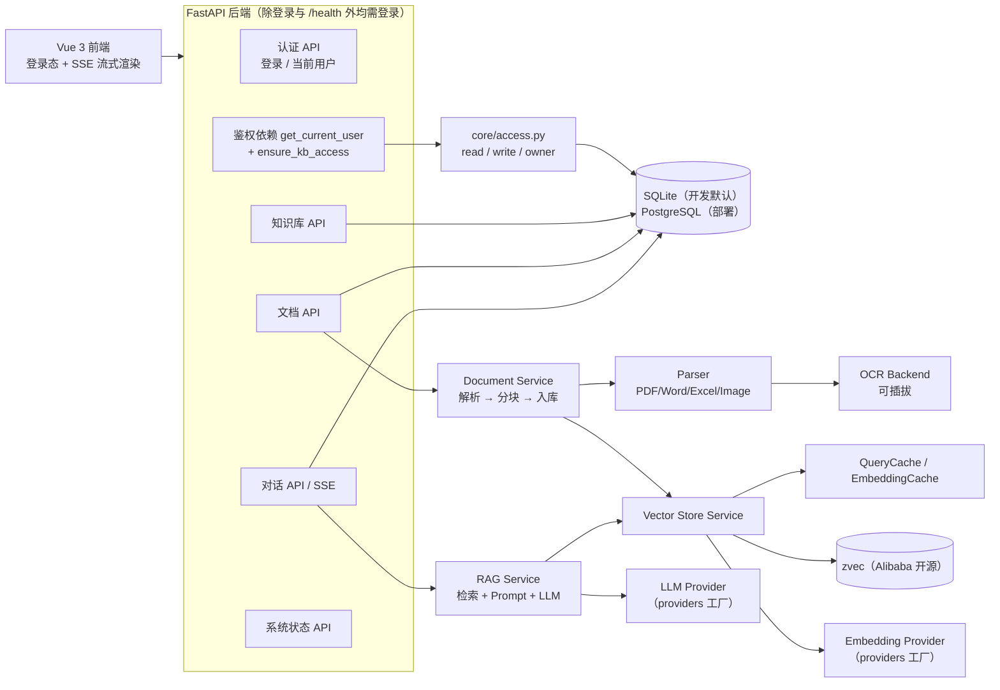

# 架构与可插拔契约

本文回答三件事：**代码怎么分层**、**每个插件点的契约是什么**、**怎么加一个新后端而不动业务代码**。
阶段路线见 `docs/DEVELOPMENT_PLAN.md`。

## 0. 系统概览

> 本节原为 README 的「特性 / 架构 / 技术栈」三节，README 精简后下沉到这里，内容不变。

### 0.1 能力清单

- **文档与检索**：PDF / Word / Excel / 文本类解析（图片与扫描页走可插拔 OCR）；每个知识库一个独立
  collection，统一 cosine 空间；`similarity` / `mmr` / `hybrid` 三种策略，返回**真实**相关度
  （`1 - 余弦距离`），MMR 召回项如实标注「无分数」而不是伪造 1.0
- **流式问答与会话**：SSE 逐 token 推送（先来源后答案），多轮对话取**最近** N 条历史，
  会话、消息与引用来源全部持久化
- **身份与访问控制**：本地账号 + JWT（HS256）登录，密码只存 argon2id 哈希（带随机盐），停用账号立即失效；
  知识库级 ACL 分 `read`（看库 / 提问）/ `write`（+ 增删文档）/ `owner`（+ 改设置 / 删库 / 授权成员）三级，
  列表按「我拥有或被授权」过滤
- **模型后端可插拔**：Chat 与 Embedding 各自独立选型（Ollama / OpenRouter / DeepSeek / OpenAI 兼容 /
  离线 mock），只改 `.env`；provider 名写错或漏填 Key 时得到「该去 `.env` 改哪个变量」的明确提示（503）。
  七个插件点（provider / 向量库 / 缓存 / 队列 / 关系库 / 精排 / 查询改写）统一走 `plugins/` 注册表，
  第三方包可用 entry point 注册实现而**不改本项目源码**；`GET /api/system/plugins` 可查当前后端与全部可选项
- **性能与成本控制**：Embedding 缓存（按 `provider:model` 隔离）+ 检索缓存（LRU + TTL，按库精确失效）、
  批量嵌入**真并发**（信号量限流 + 单批指数退避重试）、模型实例在工厂内复用、
  文档入库走有界并发的后台队列（带退避重试）
- **可观测与工程化**：每个请求一个 `request_id`（贯穿响应头、日志与 trace）；检索 / 问答 / 入库全链路
  span 计时，可选上报 LangSmith（默认关闭，零网络零费用）；`LOG_FORMAT=json` 一行一 JSON；
  `GET /api/system/metrics` 输出延迟分位、空召回、缓存命中与 token 用量；uv 锁依赖、Alembic 迁移、
  生产环境拒绝用默认 / 过短的 JWT 密钥启动、ruff + mypy、离线 pytest 全量用例 + 联网验收用例、
  Dockerfile + docker compose

### 0.2 组件关系



检索链路：查询 → 查询改写（可插拔，默认 none）→ 逐条查询做「向量召回 ∪ 词面 BM25 召回」→
按分块融合 → 阈值过滤 → 精排（可插拔，默认 none）→ 检索缓存 → 组装 Prompt
（含最近几轮对话历史）→ LLM（流式 / 非流式）→ 落库并返回引用来源。

`providers/` 内部分层：`specs`（provider 元数据与校验，含 base_url / 模型名 / key 环境变量名）、
`chat`（Chat 模型构造 + 离线 mock 模型）、`embeddings`（向量模型构造 + 截断包装 + 离线 mock 向量）、
`factory`（按配置构造并缓存实例、探活、模型发现）。

`plugins/registry.py` 是所有插件点的名单来源：`Registry[T]` 把「有哪些实现」变成运行时可枚举的数据，
内置实现在各自模块注册，第三方包用 entry point（`inner_rag.chat_providers` / `inner_rag.embedding_providers` /
`inner_rag.vector_stores` / `inner_rag.cache_backends` / `inner_rag.task_queues` /
`inner_rag.rerankers` / `inner_rag.query_rewriters`）追加。
关系库访问统一走 `repositories/`（`build_repositories(db)` 返回聚合仓储，与请求共享同一个会话）。

### 0.3 技术栈

| 层次 | 选型 |
| --- | --- |
| 语言 / 包管理 | Python 3.13（uv 管理）、`uv.lock` 锁定依赖 |
| Web 框架 | FastAPI 0.141+、Uvicorn 0.54+、SSE 流式响应 |
| LLM 编排 | LangChain 1.x（`langchain-core` 1.6+、`langchain-text-splitters`）+ `langchain-ollama`（本地）/ `langchain-openai`（OpenAI 兼容云端）/ `langchain-deepseek`（DeepSeek 官方集成） |
| 向量库 | **zvec 0.7.0**（Alibaba 开源、嵌入式、HNSW + cosine，默认后端，锁版本）；ChromaDB 1.5+ / `langchain-chroma` 保留为兼容后端（`VECTOR_STORE=chroma`）；`memory` 零依赖进程内实现（测试 / CI / 替换演练用） |
| 关系库 | SQLite（开发默认）+ PostgreSQL 16（部署可选）+ SQLAlchemy 2.1 + Alembic 1.20 |
| 认证与权限 | JWT（PyJWT，HS256）+ argon2id 口令哈希（argon2-cffi）+ 知识库级 ACL（owner / member） |
| 文档解析 | pypdf、PyMuPDF、python-docx、docx2txt、openpyxl、xlrd、Pillow、chardet |
| 前端 | Vue 3 + Vite + Pinia + Tailwind CSS 3 |
| 质量 | ruff、pytest（+ pytest-asyncio）、mypy |

> **向量库选型**：本项目选用 **zvec**（[Alibaba 开源](https://github.com/alibaba/zvec)的嵌入式向量库，
> Apache-2.0，定位「向量库里的 SQLite」：进程内嵌入、无需独立服务、HNSW + cosine、WAL 持久化），
> 理由是「零运维」，与 SQLite 单文件开发模型一致。Phase 4 起 zvec 已是默认后端（`VECTOR_STORE=zvec`），
> ChromaDB 保留为兼容实现；两者受同一个 `VectorStore` 契约约束并跑同一套契约测试（见本文 3.2）。
> Phase 7 又加了 `memory`（零依赖进程内实现，`VECTOR_STORE=memory`）：它是「换后端不改业务代码」的实证——
> 新增它只加了一个实现类 + 一次注册，同一套契约用例直接全绿；代价是数据只在内存、重启即丢，仅供测试与演练。
> 注意内嵌 zvec 按 collection 目录独占写锁，**必须单进程部署**（不要 `uvicorn --workers`）。

## 1. 分层与依赖方向

```
src/inner_rag/
├── main.py            # FastAPI 装配：lifespan（配置校验 + 生产密钥校验 + 任务队列起停）、
│                      #   中间件顺序（CORS 最外层）、异常处理器、路由挂载、docs 开关（ENABLE_DOCS）
├── api/               # HTTP 边界：只做参数校验与序列化，不做业务
│   ├── auth.py        #   登录 / 当前用户
│   ├── deps.py        #   鉴权依赖：Token → user；get_repositories（请求级仓储）；
│   │                  #   ensure_kb_access / ensure_doc_access（把 ACL 映射成 HTTP 语义）
│   ├── chat.py        #   对话（含 SSE 流式）
│   ├── document.py    #   上传 / 列表 / 删除 / 重新向量化
│   ├── kb.py          #   知识库 CRUD + 成员授权
│   └── system.py      #   health / providers / plugins / stats / metrics
├── services/          # 业务逻辑（与具体后端解耦的层）
│   ├── parser.py      #   文本抽取（PDF / DOCX / TXT / MD …）
│   ├── ocr.py         #   扫描件 / 图片文字识别（可插拔后端）
│   ├── document.py    #   解析 → 分块 → 入库的编排与状态机（失败抛 DocumentProcessingError）
│   ├── embedding.py   #   embedding 门面 + 缓存 + identity（含向量空间一致性校验）
│   ├── vector_store/  #   向量库插件点：base 契约与共用语义 + zvec / chroma / memory 适配
│   ├── lexical.py     #   词面检索（BM25，中文 bigram 分词，零依赖）；按库缓存倒排索引
│   ├── retrieval.py   #   检索组合层：向量 ∪ 词面融合、阈值时机、词面启用门槛、多查询融合
│   ├── rerank.py      #   精排插件点：none / lexical（候选集内 IDF 覆盖率）/ llm（listwise）
│   ├── query_rewrite.py # 查询改写插件点：none / alias（别名表）/ keywords（剥疑问框架词）/ llm
│   ├── cache.py       #   CacheBackend 契约 + memory 实现 + QueryCache / EmbeddingCache
│   ├── task_queue.py  #   TaskQueue 契约 + inprocess / inline 实现
│   ├── rag.py         #   检索 → Prompt 组装 → LLM 生成（含流式）
│   └── retrieval_log.py # 检索与 Prompt 统计
├── repositories/      # 关系库插件点：base 契约（Protocol）+ sqlalchemy 实现 + build_repositories
├── plugins/           # 插件注册表：Registry[T] + 七个插件点实例 + plugin_status()
├── providers/         # 模型后端插件层
│   ├── specs.py       #   ProviderSpec 元数据 + 解析与校验（ProviderError）+ 注册内置实现
│   ├── chat.py        #   Chat 实例构造（每 provider 一个构造器 + CHAT_BUILDERS 查表）
│   ├── embeddings.py  #   Embedding 实例构造
│   └── factory.py     #   对外门面：get_chat_model / get_embeddings / chat_health
├── models/            # SQLAlchemy ORM（knowledge_base / document / conversation / user / kb_member）
├── schemas/           # Pydantic 出入参
└── core/              # 纯策略与基础设施：不依赖 FastAPI 请求对象、不返回 HTTP 语义
    ├── config.py      #   唯一配置入口
    ├── database.py    #   引擎 / 会话（SessionLocal / get_db / init_db）
    ├── security.py    #   口令哈希（argon2id）与 Token 签发 / 校验（JWT）
    ├── context.py     #   身份 ContextVar + IdentityContextMiddleware（纯 ASGI）
    └── access.py      #   ACL 判定：level_of / level_map / accessible_kb_ids（依赖 ACLReader 协议）
```

依赖方向**只能向下**：

```
api  →  services  →  providers / repositories / plugins / core
                       ↑
              （services 不 import api；providers 不 import services；
                repositories 不 import api / services；core 不 import repositories）
```

硬性规则：

1. `services/` 不许出现 `if provider == "xxx"` 这类后端分支；后端差异只能通过
   `providers/` 门面与 `plugins/` 注册表暴露。
2. `api/` 不许直接用 provider 实例；关系库访问一律经 `repositories/`（`api/deps.py::get_repositories`
   提供请求级仓储，与 `get_db` 共享同一个会话），不自己拼查询。
3. `core/config.py` 是唯一读环境变量的地方；其它模块一律 `from inner_rag.core.config import settings`。
4. 新增依赖必须进 `pyproject.toml`；可选后端的重依赖用 `uv sync --extra` 分组，不能变成必装。
5. `core/` 只做判定与查询，**不抛 `HTTPException`**：401/403 由 `api/deps.py` 映射。
   这样权限策略能被脚本等非 HTTP 入口复用，且「谁是策略、谁是协议」界限清楚。
6. `core/` 不 import `repositories/`（否则依赖方向成环）：`core/access.py` 声明 `ACLReader` 协议，
   由 `repositories.KnowledgeBaseRepository` 结构化满足。

## 2. 插件点总表

| 插件点 | 接口/门面（现状） | 内置实现 | 配置项 | 探活 | 契约测试 |
| --- | --- | --- | --- | --- | --- |
| Chat 模型 | `providers/factory.py::get_chat_model` + `plugins.chat_providers` | ollama / openrouter / deepseek / openai / mock | `LLM_PROVIDER`、`*_CHAT_MODEL`、`*_API_KEY`、`LLM_REASONING_EFFORT` | `chat_health()` → `/api/system/health` | `tests/test_providers.py`、`tests/test_plugins.py` |
| Embedding 模型 | `providers/factory.py::get_embeddings` + `plugins.embedding_providers` | **sentence_transformers（默认，本机跑 Qwen 开源权重）**、ollama / openrouter / openai / mock | `EMBEDDING_PROVIDER`、`*_EMBEDDING_MODEL`、`SENTENCE_TRANSFORMERS_MODEL/DEVICE/BATCH_SIZE/NORMALIZE/ALLOW_DOWNLOAD`、`HF_ENDPOINT`、`EMBEDDING_MAX_INPUT_CHARS` | `provider_catalog()` → `/api/system/providers` | `tests/test_providers.py`、`tests/test_embedding.py`、`tests/test_plugins.py` |
| 向量库 | `services/vector_store/`（`base.VectorStore` 契约 + `plugins.vector_stores` 注册表） | **zvec**（默认，Alibaba 开源嵌入式向量库）；chroma 兼容实现（cosine，每库一 collection）；memory（零依赖、进程内，测试与演练用） | `VECTOR_STORE`、`ZVEC_PATH`、`CHROMA_*`（仅 chroma）、`CHUNK_SIZE`、`CHUNK_OVERLAP` | `count(kb_id)` 与关系库对账（`scripts/check_vectors.py`）+ 冒烟链路上的上传 → 检索 | `tests/test_vector_store.py`（同一份契约参数化跑三个后端，含断点续跑） |
| 精排（rerank） | `services/rerank.py`（`Reranker` Protocol + `plugins.rerankers`） | none（默认，不改顺序）、lexical（按「查询词元在候选集内的稀有度加权覆盖率」稳定重排，免模型）、llm（listwise，让模型返回编号序列） | `RERANK_BACKEND`、`RERANK_LLM_TOP_N`、`RERANK_LLM_SNIPPET_CHARS` | `reranker.is_enabled()`；`/api/system/plugins` 报当前后端 | `tests/test_rerank.py`（含「接进检索层的时机」与「实现违约时退回原顺序」用例） |
| 查询改写（query rewrite） | `services/query_rewrite.py`（`QueryRewriter` Protocol + `plugins.query_rewriters`） | none（默认）、alias（`别名=正式名` 查表，拉丁别名大小写不敏感）、keywords（剥中文疑问框架词与虚词）、llm | `QUERY_REWRITE_BACKEND`、`QUERY_REWRITE_MAX_QUERIES`、`QUERY_ALIASES` | 同上 | `tests/test_query_rewrite.py`（含「首条恒为原查询」契约与多查询召回用例） |
| 关系库 | `repositories/`（`base.py` 契约 + `sqlalchemy.py` 实现 + `build_repositories`）+ Alembic | SQLite（默认）/ PostgreSQL，均走 SQLAlchemy 2.x | `DATABASE_URL` | `lifespan` 里 `check_database()` | `tests/test_repositories.py`、`tests/test_api.py` |
| 缓存 | `services/cache.py`（`CacheBackend` 契约 + `plugins.cache_backends`） | memory（每 namespace 一份 LRU，可配容量/TTL） | `CACHE_BACKEND`、`QUERY_CACHE_MAX_SIZE`、`QUERY_CACHE_TTL`、`EMBEDDING_CACHE_MAX_SIZE` | `/api/system/stats` 的 `*_cache.stats()`（含命中率） | `tests/test_cache.py`（`BACKEND_FACTORIES` 参数化） |
| 后台任务 | `services/task_queue.py`（`TaskQueue` 契约 + `plugins.task_queues`） | inprocess（协程池 + 退避重试）、inline（同步执行，测试用） | `TASK_QUEUE_BACKEND`、`TASK_QUEUE_CONCURRENCY`、`TASK_QUEUE_MAX_RETRIES`、`TASK_QUEUE_RETRY_BACKOFF`、`TASK_QUEUE_HISTORY` | `/api/system/stats` 的 `task_queue.summary()` | `tests/test_task_queue.py` |
| OCR | `services/ocr.py` | none（默认）/ paddle / vlm（Phase 9） | `OCR_BACKEND`、`OCR_LANG` | 启动时记录后端与可用性 | `tests/test_parser.py` |
| 追踪 / 指标 | `core/observability.py`（Tracer 门面）+ `core/metrics.py`（注册表）+ `core/logging.py`（日志格式） | loguru + LangSmith（+ 预留 OTLP） | `LANGSMITH_*`、`LOG_FORMAT`、`LOG_SAMPLE_RATE`、`METRICS_BACKEND`、`METRICS_TOKEN`、`APP_ENV` | `/api/system/metrics`（含 tracing 状态） | `tests/test_observability.py` |
| 评测器 | `services/evaluation.py` | 指标 + LLM-as-judge | 评测集路径、judge 模型 | 报告产出 | `tests/test_benchmark_metrics.py` |
| 身份 / 权限 | `core/security.py`（策略原语）+ `core/access.py`（ACL，依赖 `ACLReader` 协议）+ `api/deps.py`（HTTP 映射） | 本地账号（argon2id 口令哈希）+ JWT（HS256）；知识库级 ACL：`owner` / 成员 `read` / 成员 `write` | `AUTH_SECRET_KEY`、`AUTH_TOKEN_TTL_MINUTES`、`ENABLE_DOCS` | `/api/system/health` 免鉴权（白名单另有 `/api/auth/login`） | `tests/test_auth.py` |

「五件套」标准：**接口 + 内置实现 + 配置项 + 探活 + 契约测试**。少任何一件都不算可插拔完成——
尤其是探活与契约测试，这两件最容易漏，漏了就会在换后端时才发现问题。

**统一注册表（Phase 7 交付，Phase 8 扩容）**：上表里前七个插件点（chat / embedding / 向量库 / 缓存 /
队列 / 精排 / 查询改写）都由
`plugins/registry.py` 的 `Registry` 实例维护名单，因此：

- 配置写错时的报错文案能自动列出当前可选后端（不再是各处手写的常量列表，也就不会漏改）；
- 第三方包通过 entry point（`inner_rag.chat_providers` 等组名）注册实现，**不改本项目源码**；
- `GET /api/system/plugins` 直接遍历注册表，逐插件点报出「当前用哪个、还有哪些可选、哪些来自第三方」。

```bash
curl -s localhost:8000/api/system/plugins -H "Authorization: Bearer $TOKEN" | jq '.data'
# {"chat": {"configured": "deepseek", "active": true, "available": [...], ...},
#  "vector_store": {"configured": "zvec", "settings_key": "VECTOR_STORE", ...}, ...}
```

每个插件点自带 `settings_key`（驱动它的配置项名），健康检查与文档都不再另维护「插件点 → 环境变量」
的映射表——那种表一旦漏改，就会出现「接口显示的当前后端和实际用的不是同一个」。

## 3. 各插件点契约

### 3.1 Chat / Embedding provider

现状（`providers/specs.py`）：

- 每个后端由 `ProviderSpec(name, label, kind, model, base_url, api_key, api_key_env, docs_url, notes,
  model_list_authoritative)` 描述；
- `_build(kind, name)` 把 `.env` 翻成 spec；`chat_spec()` / `embedding_spec()` 负责**解析 + 校验**；
- 校验失败抛 `ProviderError`，消息里直接写明「改哪个变量」；
- `ProviderSpec.identity` = `provider:model`，写进知识库，用于**向量空间一致性**校验
  （`services/embedding.py::ensure_embedding_matches`，不一致会抛 `EmbeddingIdentityMismatch` 并提示
  `scripts/reindex_kb.py`）。校验属于 embedding 身份而不是某个向量库后端：换向量库不改变向量空间，
  换 provider / 模型才需要重建索引。

as-built（Phase 7.1）：分支已经换成注册表，`specs._build` 只在表里查名字。

```python
# src/inner_rag/plugins/registry.py
chat_providers: Registry[ChatProvider] = Registry(
    "chat", "chat provider", "inner_rag.chat_providers", "LLM_PROVIDER"
)


@dataclass(frozen=True)
class ChatProvider:
    spec: Callable[[], ProviderSpec]  # 读哪些环境变量
    build: Callable[[ProviderSpec], BaseChatModel]  # 怎么建客户端


# src/inner_rag/providers/specs.py
def _ensure_builtins() -> None: ...  # 幂等惰性注册（避开 specs ↔ chat 的循环 import）
def chat_plugin() -> ChatProvider: ...
def provider_catalog() -> dict[str, list[dict[str, Any]]]: ...  # 含 third_party 标记
```

`spec` 与 `build` **成对注册**（不是分开两张表）：这样「这个后端读了哪几个环境变量」和
「它怎么建客户端」总在同一个地方，不会出现「注册了一半（探活能过、实例建不出来）」。

契约（每个新后端都要满足）：

1. **只依赖 spec**：builder 只接收 `ProviderSpec`，不自己去读环境变量。
2. **不联网构造**：实例化时不许发请求（探活是独立方法），否则启动就卡。
3. **注入密钥用 `SecretStr`**：日志与异常里不能出现明文 Key。
4. **错误归一**：网络/鉴权/参数错误统一包成 `ProviderError`，消息含 provider、model 与可变项提示。
5. **身份稳定**：`identity` 变了就必须提示重建索引，不允许静默跨向量空间检索。

### 3.1.1 本地嵌入后端（sentence_transformers，默认）

默认 embedding 走**本机部署的开源权重**（`EMBEDDING_PROVIDER=sentence_transformers`，
默认模型 `Qwen/Qwen3-Embedding-0.6B`，1024 维）。改这条默认值的原因是运维事实，不是偏好：
云端网关的免费额度是**按请求数**限流的（一整天 1000 次），而一次全库重建要发 500+ 次请求，
「建一次库就花掉半天额度」，重试一次就超；本地权重只受 GPU 时间约束。

实现要点（`providers/embeddings.py::SentenceTransformerEmbeddings`）：

| 关注点 | 处理方式 | 为什么 |
| --- | --- | --- |
| 重依赖 | `sentence-transformers` + `torch` 放在 `uv sync --extra local-embed` | 让不用本地嵌入的部署（CI、纯云端）不必拉 500MB+ 的 torch |
| 模型加载 | **懒加载**：构造函数只读配置，`_load()` 里才 `import` 与建模型 | 保证「不联网构造」这条契约（见上），启动不被权重下载卡住 |
| 首次下载 | `SENTENCE_TRANSFORMERS_ALLOW_DOWNLOAD=true` 允许从 hub 拉；`HF_ENDPOINT` 可指向镜像 | 离线部署时改为 `local_files_only=True`，走预置的模型目录 |
| GPU 并发 | `threading.Lock()` 把推理串行化 | 一个进程里多个批次挤同一块 GPU 只会互相抢显存，不会更快 |
| query 侧前缀 | 仅当模型的 `prompts` 里真的声明了 `query` 才传 `prompt_name="query"` | 不硬编码模型名：换了模型（或该模型不需要前缀）不会把前缀错加上去 |
| 向量空间一致性 | `identity` = `sentence_transformers:<model>`，照旧写进知识库并做校验 | 换模型 = 换向量空间，必须重建索引，这一点不因走本地而豁免 |

### 3.2 向量库（`VectorStore`）

**实现者**：zvec（Alibaba 开源嵌入式向量库，Phase 4 起为默认后端，`VECTOR_STORE=zvec`）/ chroma（迁移前的实现，
保留为兼容后端，`VECTOR_STORE=chroma`）/ **memory**（Phase 7 新增：零依赖进程内实现，`VECTOR_STORE=memory`，
用于测试、CI 与替换演练）。代码在 `services/vector_store/`：`base.py`（契约与共用语义）、
`zvec_store.py`、`chroma_store.py`、`memory_store.py`、`__init__.py`（注册内置实现 + 按配置构造的
`build_vector_store` 工厂 + `vector_service` 单例）。接口层只 import 包门面，不出现任何 zvec 类型。

```python
class VectorStore(Protocol):
    async def add_documents(
        self, kb_id: int, documents: list[Document], doc_id: int, filename: str
    ) -> int: ...  # 返回「本次新写入」的分块数；必须幂等且可续跑
    def stored_chunk_keys(self, kb_id: int, doc_id: int) -> set[tuple[str, str]]: ...  # 续跑进度
    async def search(
        self,
        kb_id: int,
        query: str,
        k: int | None = None,
        strategy: Strategy = "similarity",
        score_threshold: float | None = None,
        filter_doc_ids: list[int] | None = None,
    ) -> tuple[list[tuple[Document, float | None]], int]: ...  # (结果, 被滤掉数)
    async def delete_kb(self, kb_id: int) -> None: ...
    async def delete_document(self, kb_id: int, doc_id: int) -> int: ...
    def count(self, kb_id: int) -> int: ...
    def count_chunks_by_filename(self, kb_id: int) -> dict[str, int]: ...  # 诊断：各文件分块数
    def list_doc_ids(self, kb_id: int) -> list[str]: ...  # 诊断：发现删除后的残留向量
```

#### 写入路径：流式分批落库 + 断点续跑

入库是长任务（全库 1.1 万分块、500+ 批），必须假设它**一定会被打断**（429、超时、进程被杀）。
所以写入路径按「中断是常态」设计，三个后端共用同一套语义：

```
services/vector_store/base.py::embed_batches_in_order(chunks)   # 异步生成器
    ├── 一次性派发全部批次任务（并发由 embedding_service 的信号量压到 EMBEDDING_CONCURRENCY）
    ├── 按输入顺序 await 并 yield (批次, 向量)      → 吞吐不打折、顺序有保证
    └── finally: 取消未完成的兄弟任务               → 失败是「确定且可重试」的，不留后台请求

zvec_store / chroma_store / memory_store::add_documents
    ├── stored = self.stored_chunk_keys(kb_id, doc_id)     # 进度来源**就是向量库自己**
    ├── pending = [c for c in chunks if normalized_chunk_key(c) not in stored]
    ├── async for batch, vectors in embed_batches_in_order(pending):
    │       └── 逐批 upsert + flush（zvec）/ add_documents(embeddings=...)（chroma）/ 覆盖写（memory）
    └── zvec 末尾补一次 optimize（索引收尾，幂等）
```

两条关键取舍：

- **不引入进度文件**：`(doc_id, chunk_index)` 是确定性键，向量库里有就是写过、没有就是没写。
  额外的进度文件只会多一个「和实际状态不一致」的地方。
- **不做「全部算完再写」**：一份文档整份算完才落库的话，任何一批失败都会让**已经算好的几百批作废**；
  改成逐批落库后，最坏只丢「在途的那几批」（≤ 并发上限），重跑一次就是续跑。

因此入库脚本（`scripts/build_eval_kb.py`）**默认行为是续跑**：同名知识库已存在就复用（不删向量），
只有显式加 `--rebuild` 才是「删库重来」。`add_documents` 的返回值是「本次新写入」的分块数，
所以对账与 manifest 一律取 `count(kb_id)`（向量库实际条数），不取返回值。

必须遵守的语义（契约测试逐条断言，三个后端跑同一份 `tests/test_vector_store.py`）：

- **相关度口径**：对外一律 `[0, 1]` 且越大越相关（cosine 下 `relevance = 1 - distance`），
  不允许把原始距离当相关度返回；
- **MMR 无分数**：`strategy="mmr"` 的条目 `score=None`，不过阈值过滤，排序时排在有分数之后；
- **阈值过滤计数**：被 `score_threshold` 滤掉的条数要返回，供指标统计「空召回率」；
- **元数据白名单**：只写 `base.CHUNK_METADATA_FIELDS`（`doc_id` / `kb_id` / `filename` / `chunk_index` /
  `page` / `page_start` / `page_end`）。解析器附带的 `source` / `sheet` / `ocr` 不进向量库；`doc_id` /
  `kb_id` / `chunk_index` 存字符串、页码字段存整数（没有页码就不写）。Phase 4 起白名单是唯一口径：
  旧 Chroma 实现把解析器元数据原样写入，两个后端的 schema 与返回值因此不再一致；
- **写入幂等性边界**：同一文档重新向量化前必须先 `delete_document`（zvec 与 memory 用确定性分块 id，
  重复入库是覆盖；Chroma 用随机 id，重复入库会累积，所以那条路径依赖调用方纪律）。

共用语义（`base.py`，Phase 7 从各后端上移，新增后端直接复用）：

| 函数 | 作用 |
| --- | --- |
| `prepare_chunks` | 切分 + 按白名单重建元数据（`page_span` 负责页码区间，缺 `page_start`/`page_end` 时退回单页 `page`） |
| `resolve_search_defaults` | `k` / `score_threshold` 的默认值只解析一处 |
| `finalize_results` | 阈值过滤 + 相关度降序，并返回被滤掉的条数 |
| `distance_to_relevance` | cosine 距离 → `[0, 1]` 相关度 |
| `cosine_similarity` / `maximal_marginal_relevance` | MMR（`λ·sim(query,d) - (1-λ)·max sim(d,已选)`） |
| `merge_hybrid` | 相似度结果 + MMR 去重补充到 k 条（补入项分数为 `None`） |
| `chunk_key` | 混合检索去重用的分块标识 |
| `normalized_chunk_key` | `chunk_key` 的字符串化版本：`chunk_index` 在元数据里可能是 int（内存后端）或 str（zvec schema），跨后端比较「是否已入库」必须先统一 |
| `embed_batches_in_order` | 分批嵌入并按序 `yield (批次, 向量)`，让调用方边算边落库；失败时取消兄弟批次 |
| `stored_chunk_keys`（契约） | 「这份文档已经写进去哪些分块」= 断点续跑的进度来源 |
| `iter_chunks` | 读出整库分块（离线读路径，**不在检索热路径**）：词面检索建倒排索引用 |

三个后端的实现映射（as-built，细节见各自模块 docstring）：

| 契约方法 | zvec | chroma | memory |
| --- | --- | --- | --- |
| `add_documents` | 过滤 `stored_chunk_keys` → 逐批 `collection.upsert(Doc(id, vectors, fields))` + `flush()` → 收尾 `optimize()`；id 由 `kb-doc-chunk` 组装 | 过滤后再逐批 `add_documents(batch, ids=[uuid…], embeddings=已算好的向量)` + uuid id | `{kb_id: {(doc_id, chunk_index): 记录}}` 覆盖写；向量来自 `embedding_service` |
| `stored_chunk_keys` | `iter_docs(["doc_id","chunk_index"], include_vector=False)` 扫一遍再按 doc_id 筛（zvec 的 `iter_docs` 不支持 filter） | `collection.get(where={"doc_id": …}, include=["metadatas"])`；collection 不存在时按「一个都没入库」处理 | `{key for key in bucket if key[0] == doc_id}` |
| `search` | `collection.query(queries=Query(field_name="embedding", vector=...), topk, filter, output_fields)`；MMR 复用 `base` | LangChain 的 similarity / MMR 检索调用 | 纯 Python 线性扫描（`heapq.nsmallest`）；MMR / hybrid 复用 `base` |
| `count` | `collection.stats.doc_count` | `collection.count()` | `len(bucket)` |
| `delete_document` | 先 `iter_docs` 数出分块数，再 `delete_by_filter('doc_id = "…"')` | `collection.delete(where=...)` | 按 `doc_id` 过滤后从 dict 删除 |
| `delete_kb` | `collection.destroy()`（删磁盘目录 + 释放句柄） | 删除 collection | `dict.pop(kb_id)` |
| `iter_chunks` | `collection.iter_docs(include_vector=False)` 流式扫描后一次性返回 | `collection.get(include=["documents","metadatas"])` | `list(bucket.values())` 的 document 字段 |

memory 后端的边界（写清楚，避免被当成生产后端）：数据只在进程内存、**重启即丢**；线性扫描只适合
几千分块；每个实例各持一份数据、**实例之间不共享**（用例 `test_memory_backend_instances_are_isolated`
把这条边界钉住了）。

zvec 适配器的几个非直觉点（改动前先看 `zvec_store.py` 模块 docstring，那里有 zvec 0.7.0 的实测依据）：

- **维度来自首次写入**：zvec 的 schema 必须显式给维度，而维度由 embedding 模型决定，因此 collection 在
  **首次写入**时按刚算出的向量维度创建，省掉一份「向量维度」配置；维度不一致由 zvec 直接报可读错误；
- **正文必须显式存**：zvec 只保存向量与 schema 声明的标量字段，不像 Chroma 会保存 `Document` 原文，
  所以额外声明 `content` STRING 字段，检索时用它还原 `Document.page_content`；
- **写入用 `upsert` 而不是 `insert`**：zvec 的 `insert` 撞 id 只返回错误码、不抛异常，`upsert` 覆盖同一分块，
  重跑入库（重试 / 漏删）不会累积重复；
- **单进程写**：zvec 的写锁按 collection 目录独占、**跨进程互斥**（写入进程持有时另一个进程连只读都打不开），
  因此内嵌模式必须单进程部署，不要开 `uvicorn --workers`；需要多副本时改用远程向量服务（见风险登记簿）；
- **每知识库一个 collection**：`ZVEC_PATH/kb_<id>/`；重建走「删目录 + 重跑建库」，不做原地格式转换。

HNSW + cosine 是适配器内的固定选择，路径来自 `settings.ZVEC_PATH` / `CHROMA_PERSIST_DIR`；
换 embedding 导致的向量空间变化由 `services/embedding.py` 的 `EmbeddingIdentityMismatch` 拦住。

### 3.2.1 检索组合层：向量 ∪ 词面（Phase 8.1）

`VectorStore.search` 只回答「**这个向量库**怎么查」；「这次查询该用哪几路召回、怎么合成一个可比较的
分数」是业务决策，放在 `services/retrieval.py`：

```
services/retrieval.py::search(kb_id, query, k, strategy, score_threshold, filter_doc_ids)
    ├── vector_service.search(..., score_threshold=0.0)   # 阈值不在这里生效
    ├── [前置门] dense_support or 词面最强匹配 >= HYBRID_MIN_SPARSE_SCORE
    │       └── lexical_index.search(...) → normalize_scores(...) × HYBRID_SPARSE_WEIGHT
    ├── fuse(dense, sparse, k)                            # 按 chunk_key 去重，取两侧较大分
    └── finalize_results(fused, threshold)                # 阈值在融合之后统一生效
```

三条不变量（都有单测钉住，见 `tests/test_retrieval.py`）：

1. **阈值只在融合后生效**：传给向量库的 `score_threshold` 恒为 `0.0`。先按阈值过滤再融合，会把
   「向量分低但词面完全匹配」的候选提前丢掉，而补上这一路正是融合的目的。
2. **分数必须同量纲**：BM25 是无上界的（实测单题最高 82.4），先归一到 `[0, 1]` 再乘权重，
   否则 `RETRIEVAL_SCORE_THRESHOLD` 对两路召回不是同一把尺子。
3. **词面是补充，不是独立召回源**：两路里至少要有一路拿出实质证据才启用词面
   （稠密侧有过阈值候选，或词面最强匹配 ≥ `HYBRID_MIN_SPARSE_SCORE`）。缺了这条，
   归一化保证的「词面第一名恒为权重值」会让任何字面重叠过的 chunk 必然进 context，
   把「库里没有相关内容」翻案成假召回——**实测拒答正确率 100% → 0%**。
   标定数据与被挡下的两次尝试见 `docs/evaluation.md` 4.5 / 7.1。

`strategy` 对外语义不变：`similarity` 纯向量、`mmr` 纯向量 + 多样性、`hybrid` = 向量 ∪ 词面
（向量侧内部仍是「相似度 + MMR 补位」，见 `merge_hybrid`）。**问答、基准、探针脚本共用这一条路径**，
所以「评测涨了、线上没变」这类偏差不会出现——`rag_service.retrieve` 与 `benchmark/run_bench.py`
都调 `retrieval.search`。

`services/lexical.py`（词面检索）的两个设计取舍：

- **分词用中文 bigram，不引分词器**：字 bigram（「陈墨瞳」→ 陈/墨/瞳/陈墨/墨瞳）对专名足够，
  零依赖、确定性、可离线测；第三方词典对小说专名反而会切错。拉丁字母与数字按词切并小写；
  单字也保留一份（query 只有单个汉字时 bigram 为空）。换行不切断 bigram——先取字序列再组 bigram，
  所以正文里「陈墨\n瞳」这种跨行排版仍能匹配。
- **索引按知识库缓存在进程内**，由 `VectorStore.iter_chunks` 建一次。内容变化时必须
  `lexical_index.invalidate(kb_id)`，调用点与 `query_cache.invalidate_kb*` 成对出现
  （入库完成、删文档、删库、重建脚本、清缓存接口）；漏掉会变成「入库了却检索不到」。
  与 memory 缓存后端同一约束：**进程内缓存只能清本进程那份**，多进程部署要重启或走清缓存接口
  （见 §6）。

### 3.3 关系库与 Repository

as-built（Phase 7.4）：SQLAlchemy 2.x 同步 ORM + Alembic；SQLite 打开 WAL、外键与 `busy_timeout`；
PostgreSQL 共用同一套迁移（`migrations/`）。**仓储是访问关系库的唯一入口**：

```python
# src/inner_rag/repositories/__init__.py
@dataclass(frozen=True)
class Repositories:
    kbs: KnowledgeBaseRepository
    docs: DocumentRepository
    convs: ConversationRepository
    users: UserRepository


def build_repositories(db: Session) -> Repositories: ...  # 换关系库只改这里
```

```python
# src/inner_rag/repositories/base.py（契约；实现见 sqlalchemy.py）
class UserRepository(Protocol):              # get / find_by_username —— 只读
class KnowledgeBaseRepository(Protocol):     # create / get / list_all / list_page / update / delete
                                             # set_doc_count / owned_kb_ids / member_permissions
                                             # get_member / list_members / upsert_member / remove_member
class DocumentRepository(Protocol):          # get / list_by_kb / list_page / add_many
                                             # update_status / mark_completed / reset_for_reprocess
                                             # reset_kb_for_reprocess / count_completed
                                             # sync_kb_doc_count / delete
class ConversationRepository(Protocol):      # get / create / list_page / messages / history
                                             # append_message / touch / delete
```

契约：

- **Alembic 是唯一 schema 来源**，不许用 `Base.metadata.create_all()` 建生产表
  （仅 `AUTO_CREATE_TABLES=true` 的测试库例外）；
- 迁移必须可 `downgrade`（G1 会验证 `upgrade → check → downgrade → upgrade`）；
- SQLite 与 PostgreSQL 行为一致：时间戳存 UTC、JSON 字段用通用类型、字符串长度显式声明；
- **事务边界写在仓储里**：单实体写入（create / update / 状态迁移）各自提交；批量写入用 `add_many`
  一次提交（要么全在、要么全不在）；`sync_kb_doc_count` 把「文档完成」与「库计数更新」放进同一次提交，
  避免出现「已完成但计数没变」的中间态；
- **`list_page` 的分页与过滤发生在 SQL 里**（`filter(...).count()` + `offset/limit`），
  不做「查出来再在 Python 里筛」；
- **`history(conv_id, limit)` 取最近 N 条并按时间正序返回**：先按 `(created_at, id)` 倒序取 N 条再反转，
  直接 `asc().limit(N)` 拿到的是最早 N 条，长对话里等于丢掉近期上下文（有回归用例钉住）；
- **`core/access.py` 依赖 `ACLReader` 协议**（结构化子类型），`core/` 不 import `repositories/`，
  但真正的策略（谁是 owner、成员权限怎么叠加）仍然只在 `core/access.py` 一处；
- **用户表的写入**（建号 / 改口令 / 停用）只在 `scripts/create_user.py`：那是需要口令哈希与交互式
  输入的运维动作，不属于业务链路，是刻意保留的例外。

### 3.4 缓存

as-built（Phase 7.2）：

```python
# src/inner_rag/services/cache.py
class CacheBackend(Protocol):
    name: str

    def get(self, namespace: str, key: str) -> Any | None: ...
    def set(self, namespace: str, key: str, value: Any, ttl: float | None = None) -> None: ...
    def invalidate(
        self, namespace: str, pattern: str | None = None
    ) -> int: ...  # 通配失效，返回条数
    def stats(self) -> dict[str, Any]: ...
```

- 业务缓存是 `QueryCache`（`namespace="query"`，key `f"{kb_id}:{digest}"`）与
  `EmbeddingCache`（`namespace="embedding"`，key 带 `identity`）；两者只依赖 `CacheBackend` 契约，
  所以换后端（Redis 等）不需要动检索链路；
- **namespace 隔离**：不同业务各自一份空间，「清缓存」不会误伤别的命名空间；
- query 缓存按 `kb_id` 前缀精确失效（`f"{kb_id}:*"`，文档增删改后调用 `invalidate_kb`）；
  embedding 缓存按 `identity` 前缀失效，跨模型不许命中；
- 通配用 `fnmatch.fnmatchcase` 语义（对齐 Redis `SCAN MATCH`）：`1:*` **不会**误删 `11:*`
  （有独立用例钉住）；
- 内置 `memory` 后端给每个 namespace 一份有界 LRU；容量 / TTL 来自
  `QUERY_CACHE_MAX_SIZE` / `QUERY_CACHE_TTL` / `EMBEDDING_CACHE_MAX_SIZE`；
- Phase 7 之后加 Redis 实现时，序列化必须版本化（`cache_schema_version`），避免上线后读到旧结构。

### 3.5 任务队列

as-built（Phase 7.3）：

```python
# src/inner_rag/services/task_queue.py
class TaskQueue(Protocol):
    name: str

    async def start(self) -> None: ...  # lifespan 里调用
    async def stop(self) -> None: ...
    async def submit(self, name: str, fn: TaskFn, *args, **kwargs) -> str: ...  # 返回 task_id
    def status(self, task_id: str) -> TaskRecord | None: ...
    def summary(self) -> dict[str, Any]: ...  # 各状态计数 + 并发上限
```

- 状态机：`pending → running → (succeeded | failed)`，失败会先进入 `retrying` 再转 `running`；
- 内置 `inprocess`：协程池，并发上限 `TASK_QUEUE_CONCURRENCY`，失败按
  `TASK_QUEUE_RETRY_BACKOFF × attempt` 退避重试 `TASK_QUEUE_MAX_RETRIES` 次；
  历史记录有界（`TASK_QUEUE_HISTORY`），不会无限增长；
- 内置 `inline`：`submit` 直接 `await fn()`，失败原样抛出——测试与「必须同步完成」的场景用；
- 文档链路的入口是 `doc_service.enqueue_processing` / `enqueue_import`（取代 Phase 7 前的
  FastAPI `BackgroundTasks`，见 `services/document.py` 模块 docstring）；
- 契约：任务必须**幂等**（重试不会重复入库）、失败要留可读原因（写回 `document.error_msg`）、
  并发要有上限（避免免费额度被瞬间打爆）。

### 3.6 OCR

`OCR_BACKEND=none|paddle|vlm`：

- `none`：遇到图片 / 扫描件**显式失败**并说明如何开启，不许静默丢内容；
- `paddle`：本地推理，重依赖，按 extra 安装；
- `vlm`（Phase 9）：走 OpenAI 兼容接口传 base64 图片，成本进 trace。

### 3.7 追踪与指标（Phase 5 已交付）

- `core/observability.py` 暴露 `Tracer` 门面：对外只有 `tracer.span(name, **metadata)` 一个入口，
  span 树靠 contextvar 串成父子关系，调用方不用传 parent。
- **降级链**：`LANGSMITH_TRACING=false`（默认）→ 只本地计时日志；
  开了但 Key 缺失 / Client 初始化失败 → 一行 WARNING + 同样降级；
  运行中上报失败 → 丢弃该 span 并计 `tracing_errors_total`，**绝不抛给请求**。
- **采样**：`LOG_SAMPLE_RATE` 只在根 span 判定（半棵树的 trace 没法排障）；失败请求 100% 记录。
- **脱敏**：trace 只记元数据与统计（条数、长度、耗时、token），不记 Prompt 与回答正文。
- `core/metrics.py` 是进程内注册表（counter + 有界蓄水池直方图），
  `METRICS_BACKEND=prometheus` 时导出 summary 格式的文本；多副本部署时各记一份（已知边界）。
- 契约测试：`tests/test_observability.py`（零网络、上报失败不影响请求、request_id 串联、
  JSON 可解析、span 层级、指标与 Prometheus 导出）。
- 细节（trace 树、metadata 约定、日志 schema、指标清单）见 `docs/observability.md`。

### 3.8 身份与访问控制

**范围**：单租户 + 本地账号 + 知识库级 ACL。明确不做多租户、部门隔离、文档级权限、SSO/LDAP、
审计、注册接口与 logout 接口（见 `docs/DEVELOPMENT_PLAN.md` Phase 3 与第 9 节 ADR）。

**分层**：策略在 `core/access.py`，HTTP 映射在 `api/deps.py`（`core/` 不产生 HTTP 语义，见第 1 节规则 5）。

- **账号与口令**：账号存 `users` 表，口令只存 **argon2id** 哈希（`argon2-cffi`，自带随机盐），
  校验用 `PasswordHasher.verify`，不自己实现比较逻辑。从未设置过口令的账号写哨兵值 `"!"`
  ——它在任何输入下都不可能验证通过（迁移期为已存在的库自动创建的管理员账号就是该状态，
  需 `--reset-password` 激活）。
- **登录与 Token**：`POST /api/auth/login` 校验通过后签发 **JWT（HS256，PyJWT）**，载荷只有
  `sub`（user_id）、`iat`、`exp`（`AUTH_TOKEN_TTL_MINUTES`，默认 720 分钟），**不装权限快照**
  ——权限每次请求实时查库，因此「改权限 / 移除成员」立即生效、无需重新登录。
  登录失败（用户名不存在、口令错、账号停用）统一返回同一条 401 文案，不泄露账号是否存在。
- **密钥强度**：`DEBUG=false` 时若 `AUTH_SECRET_KEY` 仍是默认值或短于 32 字节，应用
  **拒绝启动**（`verify_production_secret`）——短 HMAC 密钥可被离线爆破，属于启动期就该炸的错误。
- **身份注入**：`IdentityContextMiddleware`（纯 ASGI，不用 Starlette 的请求对象）解析
  `Authorization: Bearer`，把 `user_id` 写进 `contextvars`；日志格式统一带 `user=`（`core/context.py`
  的 `log_user()`），**不靠每个函数手动传参**。
- **授权（ACL）**：`knowledge_bases.owner_id`（NOT NULL、FK `RESTRICT`、带索引）+ `kb_members
  (kb_id, user_id, permission)`。三级：`owner` > `write`（含 `read`）> `read`；无记录即无权。
- **HTTP 语义**：未登录 / Token 过期、篡改、账号已停用 → **401**（带 `WWW-Authenticate: Bearer`）；
  已登录但无权访问目标 kb → **403**；kb 不存在 → **404**；会话 ID 属于别的库同样 404（不泄露存在性）。
  `GET /api/kb` 只返回 `accessible_kb_ids()` 的结果。
- **检索边界**：权限判定发生在进入服务层**之前**——每个涉及 kb 的路由都挂 `ensure_kb_access` 守卫；
  不允许在 `services/rag.py` 里用「检索后再过滤掉不可见的 kb」来补。
- **免鉴权白名单**：只有 `POST /api/auth/login` 与 `GET /api/system/health`（后者必须免鉴权且永不 5xx）；
  `/docs`、`/redoc`、`/openapi.json` 由 `ENABLE_DOCS` 控制，生产建议关闭。

**已知取舍**（写明是为了不被当成 bug）：Token 存 localStorage（无 logout 接口，客户端丢弃即可）；
停用账号（`is_active=false`）会让已签发 Token 立即失效，但**改口令不会**——JWT 无状态，
短 TTL 是泄漏后的唯一收敛手段（见 `configuration.md`）。

### 3.9 精排（rerank，Phase 8.2）

**为什么单开一层**：`retrieval.py` 的融合分只有一个维度，它决定「谁进 Top-k」；但**谁进 context**
是另一件事——`RERANK_TOP_K`（默认 5）小于 `TOP_K`（默认 8），Top-k 里排在 6–8 位的候选会被整条丢掉。
小库实测显示这一段恰好是失分点：三道题的期望页卡在 6–8 位，且它们与第 5 名的分差只有
**0.003–0.04**（见 `evaluation.md` 4.6）——粗排在这么窄的区间里排序本来就不可靠：粗排融合的是
「两条召回通道的置信度」，而精排可以直接看「候选与查询的贴合程度」，这是两种不同的证据。

**契约**（每个实现都要满足，`tests/test_rerank.py` 逐条验证）：

1. **只改顺序，不得增删，也不得改分。** 分数既用于 `RETRIEVAL_SCORE_THRESHOLD` 判定，也用于前端展示；
   让 rerank 改分会让「同一个阈值」在不同配置下含义不同，两次评测也就无法对照。
2. **失败必须退回原顺序**：抛异常、解析不出、模型返回垃圾时一律原样返回。精排是「有则更好」的一层。
3. 默认 `none`（不启用）。rerank 必然改变排序，必须先在评测集上证明有提升再打开。

```python
# src/inner_rag/services/rerank.py（契约）
class Reranker(Protocol):
    name: str

    async def rerank(self, kb_id: int, query: str, results: RetrievalResult) -> RetrievalResult: ...
```

| 实现 | 做法 | 成本 |
| --- | --- | --- |
| `none`（默认） | 原样返回，`is_enabled()` 为假时检索层根本不会调用 | 零 |
| `lexical` | 按「查询词元在**候选集内**的稀有度加权覆盖率」稳定重排。`candidate_idf(term) = log(1 + (N - df + 0.5) / (df + 0.5))`——查询词在这批候选里人人皆有时无信息量 | 零（纯本地计算） |
| `llm` | listwise：把前 `RERANK_LLM_TOP_N` 条候选带 `RERANK_LLM_SNIPPET_CHARS` 字符片段交给模型，要求返回编号序列；`parse_order()` 抽数字 → 去重 → 丢越界，剩余 tail 接在后面 | 一次 LLM 调用 |

**接进检索层的时机**在 `retrieval._finish`：阈值过滤 **之后**。顺序反过来的话，精排会把一些
本该被阈值滤掉的候选排进 Top-k，等于绕过了阈值。如果某个实现返回的条数与输入不一致（违约），
检索层退回原顺序并把 span 标记 `violated=True`，而不是信任它的输出。

### 3.10 查询改写（query rewrite，Phase 8.3）

**为什么单开一层**：小库实测里有两类题是纯措辞问题，跟向量质量无关——**别名题**
（「Sakura 是谁？」：Sakura 与「路明非」字面毫无重合，词面检索帮不上，embedding 也拉不到一起，
只能靠外部知识把别名展开）与**口语化提问**（「诺诺的真名是什么？」：`是什么` / `的` 这类疑问框架
稀释了 BM25 的词元集，真正有区分度的实词反而压不过噪声）。

**契约**：

1. `rewrite` 返回**要检索的查询列表，且必须把原查询放在第一位**——由模块级入口统一兜住，
   任何实现都不能违反。这样「改写没帮上忙」时最坏也只是多跑一路召回，不会比不改写更差。
2. 变体数由 `QUERY_REWRITE_MAX_QUERIES`（默认 3，含原查询）截断，避免把检索成本放大。
3. 改写**不改变阈值语义**：多路召回的结果按分块取最大分融合，阈值仍在融合之后统一生效。
4. 失败退回 `[query]`。

```python
# src/inner_rag/services/query_rewrite.py（模块级入口，所有实现都经它收口）
async def rewrite(kb_id: int, query: str) -> list[str]:
    queries = await query_rewriter.rewrite(kb_id, query)
    limit = max(1, settings.QUERY_REWRITE_MAX_QUERIES)
    ordered = [query]  # 首条恒为原查询
    for item in queries:
        text = item.strip()
        if text and text != query and text not in ordered:
            ordered.append(text)  # 去空、去重、去与原查询等价的条目
    return ordered[:limit]
```

| 实现 | 做法 |
| --- | --- |
| `none`（默认） | 原样返回 `[query]` |
| `alias` | 查 `QUERY_ALIASES`（`别名=正式名` 逗号分隔）；坏行告警跳过，不静默；拉丁别名大小写不敏感，中文精确匹配 |
| `keywords` | `strip_stopwords()` 把 `STOPWORDS`（中文疑问框架 + 虚词 + 英文疑问词，按长度降序匹配以免「为什么」被「为」先吃掉）**替换成空格**（不是删掉，以保留词边界）：`"诺诺的真名是什么？" → "诺诺 真名"` |
| `llm` | 让模型输出若干改写行；`_parse_lines()` 去编号前缀、去重、剔除与原查询等价的条目 |

**多查询如何融合**：`retrieval.search()` 对每个变体各跑一次「向量 ∪ 词面」召回，按分块取最大分合并，
再做阈值过滤与精排。因此一条改写最多把召回成本乘以变体数——这也是默认关闭、且限制条数的原因。

## 4. 关系库 vs 向量库：各存什么、怎么对账

两个**不同职责**的存储，缺一不可，也不互相替代。

| 维度 | 关系库（SQLite / PostgreSQL） | 向量库（zvec / chroma / memory） |
| --- | --- | --- |
| 存什么 | 结构化事实：知识库、文档元数据与状态、会话与消息、引用来源、用户与 ACL | 分块文本 + 其**向量**，以及检索用元数据（`doc_id` / `kb_id` / `filename` / `chunk_index` / `page` / `page_start` / `page_end`） |
| 回答什么问题 | 「有哪些库、哪些文档、处理到哪一步了、谁问了什么」 | 「哪些分块的语义最接近这个问题」 |
| 查询方式 | SQL：等值 / 范围 / 排序 / 事务（ACID） | 近似最近邻（ANN，HNSW + cosine 距离；memory 后端是精确线性扫描） |
| 索引依据 | 主键 / 外键 / 普通索引 | 向量索引（HNSW 图），依赖 embedding 空间 |
| 一致性角色 | **权威（source of truth）**：文档状态机、`kb.embedding_key`、ACL 都在这里 | **可重建的派生物**：换 embedding 或分块参数后重跑建库即可 |
| 规模量级 | 以行为单位（开发期单文件 SQLite / 部署期 PG） | 与分块数成正比（全库 ~2,900–3,000 个分块、1024 维） |
| 能看到什么 | 文档数、分块数、状态分布 | 只能查到向量数（`count()`），不知道业务状态 |

分工与对账：

1. **先写关系库，再写向量库**：上传文档先落 `documents`（状态 `pending`），解析分块后写向量，
   成功才推进到 `completed`。状态机是「文档能不能被检索」的唯一判据。
2. **对账口径**：向量库 `count(kb_id)` 必须等于关系库中该库 `completed` 文档的分块数之和；
   `scripts/check_vectors.py` 与 `/api/kb/{kb_id}` 都按这个口径体检，不一致就是 bug。
   两个脚本都走 `build_repositories()`，与业务链路共用同一套查询（不各自拼 SQL）。
3. **重建而非修补**：向量是派生物，换了 embedding / 分块参数 / 向量库实现后，**不试图原地修改**，
   走「新建库目录 + 重跑建库」，关系库里的业务数据不动（见 `scripts/reindex_kb.py`）。
4. **一致性边界**：不做跨存储的分布式事务（本系统不需要）；允许「向量已写、状态未推进」的中间态，
   但**不允许**「状态 `completed` 而向量缺失」——这由对账脚本与重试兜住。

一句话：关系库存「**我们知道什么**」，向量库存「**怎么找到它**」。

## 5. 怎么加一个新后端（分步指南）

**示例 A：加一个 OpenAI 兼容的 chat 网关 `mygateway`**

1. `core/config.py` 增 `MYGATEWAY_BASE_URL` / `MYGATEWAY_API_KEY` / `MYGATEWAY_CHAT_MODEL`；
2. `providers/chat.py` 加一个构造器（`build_mygateway_chat(spec)`）并进 `CHAT_BUILDERS` 查表；
3. `providers/specs.py` 加一个 spec 工厂（`_mygateway_chat()`）并注册进 `chat_providers`
   （`ChatProvider(spec=_mygateway_chat, build=CHAT_BUILDERS["mygateway"])`）；
4. `.env.example` 补三行与注释；
5. 测试：`tests/test_providers.py` 加「已配置 → OK / 缺 Key → 可读报错 / 模型不在列表 → warning」；
   需要时在 `tests/test_live_providers.py` 加 `-m live` 用例；
6. 文档：README 的 provider 表加一行。

**示例 B：加一个向量库 `pgvector`**（内置的是 zvec / chroma / memory，见 3.2）

1. `services/vector_store/` 下新增 `pgvector_store.py`，实现第 3.2 节全部方法；
   **直接复用** `base.prepare_chunks` / `finalize_results` / `resolve_search_defaults`，
   需要 MMR / 混合检索时用 `base.maximal_marginal_relevance` / `base.merge_hybrid`；
2. `services/vector_store/__init__.py` 里加 `_build_pgvector()` 并
   `vector_stores.register("pgvector", _build_pgvector)`（**不再改 `build_vector_store` 的分支**：
   它只查注册表，报错文案会自动带上新名字）；
3. 依赖进 `pyproject.toml` 的可选 extra；
4. **把 `"pgvector"` 加进 `tests/test_vector_store.py` 的 `store` fixture 参数**——
   契约用例会立刻全量跑一遍新后端，这是「替换演练」的判定标准；
5. 迁移或建表脚本 + README「换向量库」小节（含「必须重建索引」的警告）。

**示例 C：以第三方包的形式接后端（不改本项目源码）**

`VECTOR_STORE` 之类的插件点都支持 entry point 发现。第三方包在 `pyproject.toml` 里声明：

```toml
[project.entry-points."inner_rag.vector_stores"]
pgvector = "my_rag_pgvector:PgVectorStore"        # 无参可调用对象/类，返回 VectorStore
```

然后在 `.env` 里写 `VECTOR_STORE=pgvector` 即可。发现规则（`plugins/registry.py`）：

- entry point **加载失败只告警并跳过**（第三方包坏了不该让服务起不来）；
- 与内置**同名时保留内置实现**，防止装一个包就悄悄换掉后端。

判定标准：如果为了接一个新后端你改了 `services/rag.py` 或 `api/*.py`，说明抽象漏了，先补接口再继续。
`memory` 向量库（Phase 7.5）就是这条判定标准的实证：新增它只动了两个文件
（`memory_store.py` + `__init__.py` 里一行 `register`）加一行测试参数，业务代码零改动。

## 6. 错误与降级契约

| 场景 | 行为 | 用户看到什么 |
| --- | --- | --- |
| provider 名未知 / 需要 Key 但没填 / 不支持该能力 | 构造实例时抛 `ProviderError` | HTTP 503 + 文案指明改 `LLM_PROVIDER` / `EMBEDDING_PROVIDER` / 具体 Key 变量 |
| `VECTOR_STORE` / `CACHE_BACKEND` / `TASK_QUEUE_BACKEND` 名未知 | 构造实例时抛 `ValueError`，消息里列出当前可选后端 | 启动即失败（`vector_service` / `cache_backend` / `task_queue` 是模块级单例）；不会静默换后端 |
| 第三方 entry point 加载失败 | 只告警并跳过，服务正常起 | 启动日志一条 WARNING；`/api/system/plugins` 里不出现该后端 |
| 第三方 entry point 与内置同名 | 保留内置实现 | 启动日志一条 WARNING；`available` 里不会出现歧义名字 |
| 知识库 embedding 与当前配置不一致 | `EmbeddingIdentityMismatch` | 409/503 + 「切回原模型或跑 `scripts/reindex_kb.py`」 |
| 文档处理失败（解析 / 嵌入 / 写向量） | 状态迁移到 `failed` + `error_msg`，`process_document` 抛 `DocumentProcessingError` | 文档列表里该行为 failed 并显示原因；批量上传只记日志，不影响其它文档 |
| provider 的 `/models` 不含当前模型但该端点不权威 | 只告警 | `/api/system/health` 的 `llm.ok=true` 且 `llm.warning` 有值 |
| provider 的 `/models` 权威且不含当前模型 | 判为不可用 | `llm.ok=false` + 错误里列出可选模型名 |
| 未登录 / Token 过期或篡改 / 账号已停用 | 401（不带内部错误细节） | 「请重新登录」；前端跳登录页 |
| 已登录但无该知识库权限 | 403 | 「无权访问该知识库」；列表接口不返回无权限的库 |
| 目标 kb / 文档 / 会话不存在或属于其它库 | 404 | 「知识库不存在」等；不区分「无权限」与「不存在」以外的信息 |
| LangSmith 未配置或不可达 | 降级为本地日志 + 计时 | 无感知，仅启动/首次请求一条 warning |
| LLM 生成中途失败（流式已发头） | 发一个 `event: error` 帧并结束 | 前端展示错误，不静默截断 |

三条硬约束：

1. **`/api/system/health` 永不 5xx**：探活失败也要 200 + `ok: false`，方便监控判断；
   **插件点配置写错也只降级**（`plugins.<key>.active = false`，整体 `status=degraded`），
   因为「后端选错」不是「进程活着但没法服务」——进程内的单例其实在启动时就炸了，
   这里如实报出来是为了让「启动没炸但行为不对」也能一眼看见；
2. **配置错误要在启动或首个请求暴露**，不能等用户提问才炸出一句 401；
3. **降级路径必须有测试**：凡是「优雅降级」的分支，都要有一个离线用例证明它真的降级了。

## 7. 兼容策略

- **配置向后兼容**：新增配置项必须有默认值；改名要同时保留旧名并打 deprecation warning 一个版本。
- **API 向后兼容**：`/api/*` 响应只增字段、不改含义；破坏性变更走 `/api/v2`。
- **向量空间兼容**：`identity` 变更必须显式重建索引（有校验拦着）；分块参数（`CHUNK_SIZE` /
  `CHUNK_OVERLAP`）变更建议重建，至少在评测报告里注明。
- **缓存兼容**：结构变更要 bump 命名空间版本，避免旧值被新代码误读。
- **数据兼容**：迁移必须能在旧数据上跑通（G1 的 `downgrade base` 是最低要求）。
